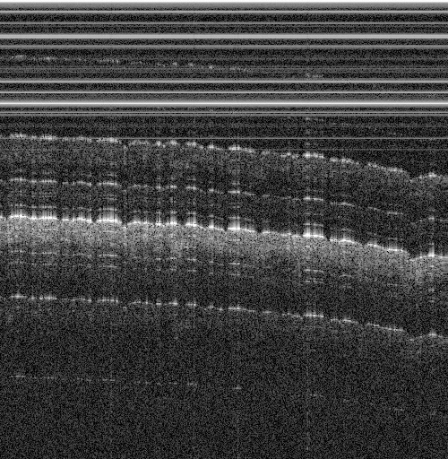

# DINOCT

DINO-style self-supervised pretraining for OCT B-scan images, plus curve head (LoRA) post-train stage.



## Repo layout

- `dinoct/`: Python package (models, data, training)
- `configs/`: YAML configs (merged: `configs/ssl_default_config.yaml` + `configs/train/oct.yaml`)
- `eval/`: evaluation entrypoints
- `tools/`: export and dataset-maintenance utilities

## Quick Start

- Python: `>=3.12`
- CUDA: single GPU

This repo uses `uv`:

```bash
uv sync
uv run python -m dinoct --help
```
## End-to-end Training

Train the default OCT recipe end to end:

```bash
uv run python -m dinoct \
  --config configs/train/oct.yaml \
  --output-dir outputs/run1
```

This uses the values already defined in `configs/train/oct.yaml` and runs SSL pretrain followed by post-train.

Outputs:

- `outputs/run1/pretrain/dinov3_pretrain.pth`
- `outputs/run1/pretrain/train.log`, `metrics.csv`, `config_used.yaml`
- `outputs/run1/post_train/fused_curve.pth`
- `outputs/run1/post_train/fused_curve_best.pth`
- `outputs/run1/post_train/val_summary.json`

To rerun only the curve post-train stage with an existing backbone, keep the same config and use:

```bash
uv run python -m dinoct \
  --config configs/train/oct.yaml \
  --output-dir outputs/run1 \
  --post-train-only \
  --pretrained-backbone outputs/run1/pretrain/dinov3_pretrain.pth
```

## Exporting 
### TorchScript/ONNX

```bash
uv run python tools/export_model.py --model outputs/post_train/fused_curve_best.pth --outdir exports
```

## Dataset
Default expected layout under `data/oct/`:

- `data/oct/raw/*.jpg`
- `data/oct/background/*.jpg`
- `data/oct/labeled/<image_stem>.txt` (optional; marks an image as labeled)
- `data/oct/extra/entries.npy` (metadata cache; regenerated each run)
- `data/oct/extra/splits.csv` (paper train/val/test assignment)

Each label file should contain either:
- 500 floats (one per column), or
- a 500×2 table `(x, y)` (the second column is used).

You can change the dataset paths via the dataset string: `OCT:root=<root>[:extra=<extra>]` (see `configs/train/oct.yaml`).
In that string, `root`/`extra` refer to dataset directories (not the repo root).
The dataset name token is case-insensitive.

Dataset are available from [https://huggingface.co/datasets/rjbaw/oct](https://huggingface.co/datasets/rjbaw/oct) and using the huggingface dataset loader.  
Set `train.dataset_path` to `OCT:hub=rjbaw/oct` (or include `root=...` for local-first).

### Labeling (curve editor)

The interactive curve label editor requires `matplotlib`:

```bash
uv sync --extra label
uv run python tools/data/curve_labeler.py --dir data/oct
```


## Reproducibility
Use `eval/run_paper.py` as the entrypoint.

Prerequisites:
- `data/oct/extra/splits.csv` exists. If it does not, generate it with:

```bash
uv run python tools/data/build_oct_manifest.py --dir data/oct
uv run python tools/data/build_oct_splits.py --dir data/oct --seed 0 --train-frac 0.7 --val-frac 0.15
```

- `outputs/pretrain/dinov3_pretrain.pth` exists.

Run the full OCT paper pipeline:

```bash
uv run python eval/run_paper.py all --resume
```

Useful subsets:

```bash
uv run python eval/run_paper.py main --resume
uv run python eval/run_paper.py robustness --resume
uv run python eval/run_paper.py ablations --resume
uv run python eval/run_paper.py low-data --resume
```

`main` trains the canonical DINOCT, UNet, and FCBR checkpoints, evaluates clean test and real-artifact stress, and refreshes the low-data full-train reference file automatically.

## License
Apache-2.0.  

This project includes alot of code derived from Meta Platforms, Inc. and affiliates' DINOv2 and DINOv3 repositories, licensed under the Apache License, Version 2.0.
