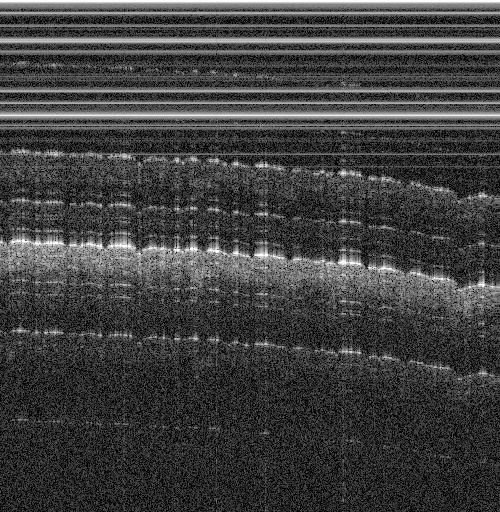

# DINOCT

DINO-style self-supervised pretraining for OCT B-scan images, plus curve head (LoRA) post-train stage.



## Repo layout

- `dinoct/`: Python package (models, data, training)
- `configs/`: YAML configs (merged: `configs/ssl_default_config.yaml` + `configs/train/oct.yaml`)
- `eval/`: evaluation entrypoints
- `tools/`: export and dataset-maintenance utilities

## Quick Start

- Python: `>=3.12`
- CUDA: single GPU

This repo uses `uv`:

```bash
uv sync
uv run python -m dinoct --help
```
## End-to-end Training

Train the default OCT recipe end to end:

```bash
uv run python -m dinoct \
  --config configs/train/oct.yaml \
  --output-dir outputs/run1
```

This uses the values already defined in `configs/train/oct.yaml` and runs SSL pretrain followed by post-train.

Outputs:

- `outputs/run1/pretrain/dinov3_pretrain.pth`
- `outputs/run1/pretrain/train.log`, `metrics.csv`, `config_used.yaml`
- `outputs/run1/post_train/fused_curve.pth`
- `outputs/run1/post_train/fused_curve_best.pth`
- `outputs/run1/post_train/val_summary.json`

To rerun only the curve post-train stage with an existing backbone, keep the same config and use:

```bash
uv run python -m dinoct \
  --config configs/train/oct.yaml \
  --output-dir outputs/run1 \
  --post-train-only \
  --pretrained-backbone outputs/run1/pretrain/dinov3_pretrain.pth
```

## Pretrained weights

Download the checkpoints from the GitHub release page and place them at the default
locations used by every entry point (release asset → destination):

- `pretrain.pth` → `outputs/pretrain/dinov3_pretrain.pth` — SSL backbone (ConvNeXt-tiny, patch 14, 625k steps)
- `post_train.pth` → `outputs/post_train/fused_curve_best.pth` — curve decoder

The release also carries `splits.csv` → `data/oct/extra/splits.csv` (the paper train/val/test
assignment), `export.onnx` (a prebuilt copy of `exports/curve_model.onnx`, see Exporting), and
`paper_results_release_*.zip` (the paper's per-experiment result artifacts without checkpoints).

## Exporting 
### TorchScript/ONNX

```bash
uv run python tools/export_model.py --model outputs/post_train/fused_curve_best.pth --outdir exports
```

This writes `exports/curve_model.onnx` (opset 18) and `exports/curve_model.ts` with the
inference contract `image [batch,3,512,500] float32 -> presence_logits [batch], z_vec [batch,500]`.

Note: for ConvNeXt checkpoints the inference patch size cannot be inferred from the weights
(it changes geometry, not parameter shapes). The exporter assumes the paper training value
(patch 14); pass `--patch-size` explicitly if your training config differs, and validate the
export on real labeled frames rather than random inputs.

### Inference Notes

The exported graphs (.onnx model) contain **no resize or normalization** (the deployment platform does its own preprocessing in C++); feeding raw pixel values will not work.

## Dataset
Default expected layout under `data/oct/`:

- `data/oct/raw/*.jpg`
- `data/oct/background/*.jpg`
- `data/oct/labeled/<image_stem>.txt` (optional; marks an image as labeled)
- `data/oct/extra/entries.npy` (metadata cache; regenerated each run)
- `data/oct/extra/splits.csv` (paper train/val/test assignment)

Each label file should contain either:
- 500 floats (one per column), or
- a 500×2 table `(x, z)` (the second column is used).

The dataset is available at [https://huggingface.co/datasets/rjbaw/oct](https://huggingface.co/datasets/rjbaw/oct).
The held-out real-artifact stress set used by the `real_hard` evaluations ships there as a
separate archive; extract it to `data/oct/eval/hard/`.
The default config (`train.dataset_path: OCT:root=data/oct:hub=rjbaw/oct`) uses a local copy
under `data/oct/` when it holds the image tree (`raw/` or `background/`) and otherwise
downloads from the Hugging Face hub.

The hub archive currently contains the **images only** (`raw/`, `background/`, `labeled/`),
not the `extra/` split metadata. Split metadata is looked up in `data/oct/extra/` first
(the documented location works even when the images come from the hub cache), then in the
extracted archive's own `extra/` dir (its path is logged at startup, under
`~/.cache/dinoct/datasets/hf_archive/`). To reproduce the paper protocol after a hub
download, copy the released `splits.csv` to `data/oct/extra/splits.csv` and generate the
manifest from the extracted images into the same place:

```bash
uv run python tools/data/build_oct_manifest.py --dir <extracted_root> --output data/oct/extra/manifest.csv
```

(or generate your own split assignment with `tools/data/build_oct_splits.py --dir <extracted_root>`).
The split metadata is only needed to reproduce the paper's train/val/test
protocol: without it, supervised post-training falls back to a seeded random 90/10
image-level split, while stages that request a **named** split (SSL train-split filtering, `--split` evaluations) stop with an explicit error instead of silently ignoring it. A
`splits.csv` without its matching `manifest.csv` triggers an explicit warning naming the
missing file.

### Labeling (curve editor)

The interactive curve label editor requires `matplotlib`:

```bash
uv sync --extra label
uv run python tools/data/curve_labeler.py --dir data/oct
```


## Reproducibility
Use `eval/run_paper.py` as the entrypoint.

Prerequisites for exact paper-number reproduction:
- `data/oct/extra/manifest.csv` and `data/oct/extra/splits.csv` exist. If they do not, generate them with:

```bash
uv run python tools/data/build_oct_manifest.py --dir data/oct
uv run python tools/data/build_oct_splits.py --dir data/oct
```

- `outputs/pretrain/dinov3_pretrain.pth` exists.

`build_oct_splits.py` assigns splits by recording/session units, not by individual timestamped capture IDs. Timestamped C-scan captures within the default 15 s session window, exact duplicate images, and near-duplicate average-hash matches from the default `--dedup-ahash-threshold 1` setting are kept in the same split unit; the generated `recording_id` values are opaque stable IDs so the private session grouping does not need to be shared separately. Use explicit `splits.csv` for paper results. If the split metadata is absent, post-training falls back to a seeded random image-level split and logs a warning — fine for general training, but not the paper protocol and not leak-safe at the recording level; evaluations that request a named split require the metadata.

Generate the paper SSL backbone if it is not already present:

```bash
uv run python eval/run_paper.py pretrain
```

Run the full OCT paper pipeline (trains and evaluates everything into `outputs/paper_results/`):

```bash
uv run python eval/run_paper.py all
```

The defaults ARE the paper protocol (seeds 0-4, post-train batch size 128) — do not override
them when reproducing paper numbers. Every experiment writes per-recording CSV/JSON summaries
under `outputs/paper_results/`; the paper reports the mean±std across recordings of the
seed-averaged per-recording metric. Use `--resume` to continue an interrupted run. Individual stages (`main`, `classical`,
`robustness`, `ablations`, `norms`, `lora-placement`, `low-data`) are available via
`eval/run_paper.py --help` if you only need one table.
- `classical` regenerates the classical OCT baselines into `outputs/paper_results/classical_eval/`.
- `robustness` regenerates the learned-model robustness suite and also refreshes the classical artifacts required by the paper robustness and failure-rate tables.
- `ablations` reruns the final single-component DINOCT ablations and can aggregate multiple seeds into `final_component_ablation.csv` plus per-seed rows in `final_component_ablation_per_seed.csv`.
- `low-data` regenerates the label-budget comparison and rewrites the data-efficiency manifests.

## License
Apache-2.0, with one exception described below.

This project includes a substantial amount of code derived from Meta Platforms, Inc. and
affiliates' [DINOv2](https://github.com/facebookresearch/dinov2) repository, licensed under
the Apache License, Version 2.0 (see `LICENSE`).

The following files are derived from Meta Platforms, Inc. and affiliates'
[DINOv3](https://github.com/facebookresearch/dinov3) repository and are used and
redistributed under the terms of the DINOv3 License Agreement (see `LICENSE-DINOV3.md`),
as marked in their headers:

- `dinoct/data/adapters.py`, `dinoct/data/augmentations.py`, `dinoct/data/collate.py`, `dinoct/data/datasets/decoders.py`
- `dinoct/layers/attention.py`, `dinoct/layers/block.py`, `dinoct/layers/ffn_layers.py`, `dinoct/layers/rope.py`
- `dinoct/loss/gram_loss.py`
- `dinoct/models/convnext.py`, `dinoct/models/vision_transformer.py`
- `dinoct/utils/__init__.py`, `dinoct/utils/utils.py`
- `eval/backbone_norm_ablation/convnext_backbone_norm_ablation.py`
